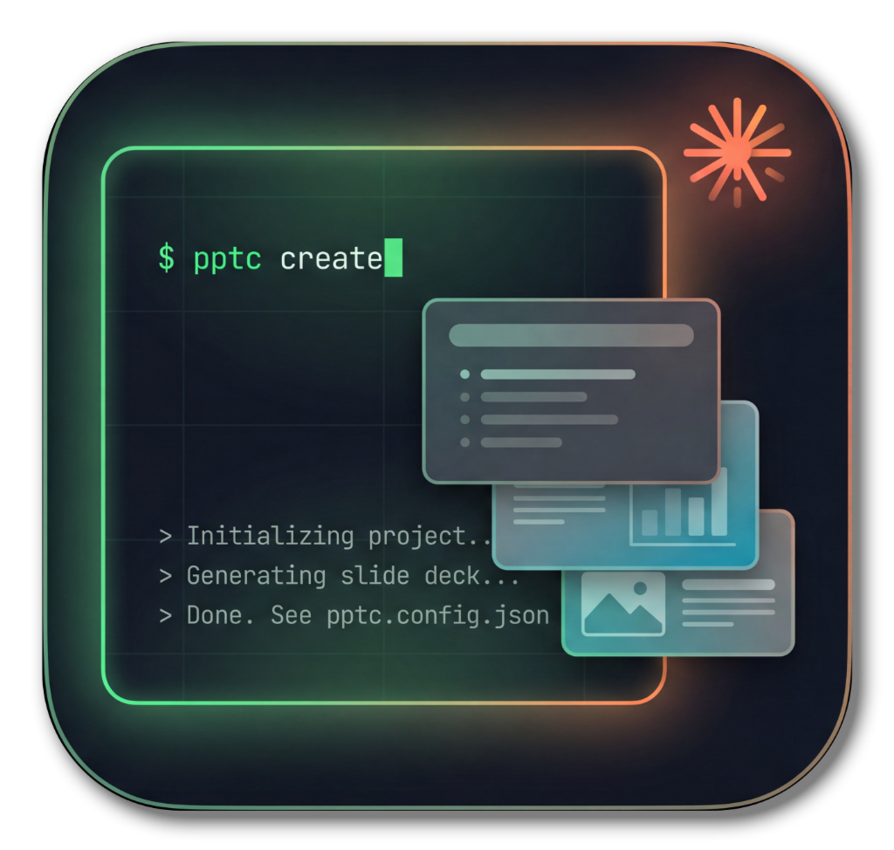

<p align="center">
  
</p>

# pptc

**Deterministic PowerPoint (PPTX) CLI for LLM agents.**

`pptc` creates and edits PowerPoint presentations from the command line --
template-aware, schema-validated and atomic. It is designed to be driven by an
LLM agent (e.g. a Claude Code skill): every command emits exactly one JSON
envelope on stdout, every failure has a stable error code and exit code, and
every write either fully applies or leaves the file byte-identical.

```
$ pptc state deck.pptx --level summary
{
  "ok": true,
  "cmd": "state",
  "file": "/work/deck.pptx",
  "rev": "27d7f5a4ea5a",
  "result": { "slideCount": 4, "slides": [ ... ] }
}
```

## Why

Building PPTX files through ad-hoc scripting is fragile for agents: shell
quoting mangles JSON, slide indices shift when users edit between turns,
half-applied edits corrupt decks, and errors arrive as prose. `pptc` fixes
these structurally:

- **One write path.** All mutations are *ops* in a JSON document, validated as
  a whole (Zod schemas) before the first byte is touched, then applied in one
  atomic write. `--dry-run` is the same pipeline without the write.
- **Stable addressing.** Slides are addressed by their OOXML `sldId`
  (`id:257`), exact title (`title:Agenda`), or a document-local `$ref` --
  not by fragile positions (though `index:N` exists as an escape hatch).
- **Optimistic locking.** `state` returns a `rev` token; `apply --rev` (or
  `expectRev` in the document) fails with exit 6 when the deck changed
  underneath.
- **Templates as data.** `tpl describe` turns any `.potx`/`.pptx` into an
  LLM-readable description: per layout an ASCII minimap, semantic positions
  ("linke Spalte, volle Höhe"), text capacities and image aspect ratios --
  derived generically from the OOXML geometry, no template-specific code.
- **Typed failures.** Exit codes per error class, machine-readable
  `error.code`, and Zod issue paths in `error.details` for self-correction.

## Installation

```
npm install -g @brusdeylins/pptc
pptc --version
```

Or without installing: `npx @brusdeylins/pptc ...`. Requires Node.js >= 20.

## Quick Start

```bash
# 1. understand the template (the LLM picks layouts from this)
pptc tpl describe corporate.potx

# 2. create a deck and build it in one run
pptc new deck.pptx --template corporate.potx --ops @ops.json

# 3. read the truth back
pptc state deck.pptx --level full
```

`ops.json`:

```json
{
  "ops": [
    { "op": "slide.add", "ref": "intro", "layout": 0,
      "placeholders": {
        "title":    { "text": "Mein Vortrag" },
        "subtitle": { "text": "Untertitel" }
      },
      "notes": "Begrüßung." },
    { "op": "slide.add", "layout": 4,
      "placeholders": { "title": { "text": "Zahlen" } } },
    { "op": "el.add", "slide": "title:Zahlen", "elements": [
      { "type": "chart", "frame": { "x": 0.7, "y": 1.9, "w": 12, "h": 4.7 },
        "data": { "type": "column", "categories": ["Q1", "Q2"],
                  "series": [{ "name": "Umsatz", "values": [10, 14] }] } }
    ] },
    { "op": "slide.move", "slide": "$intro", "to": 0 }
  ]
}
```

Small fixes need no JSON file:

```bash
pptc text deck.pptx --slide title:Zahlen --ph title "Zahlen 2026"
pptc note deck.pptx --slide id:257 "Neuer Sprechertext"
pptc rm   deck.pptx --slide index:3
pptc apply deck.pptx -e '{"op":"slide.move","slide":"id:257","to":1}'
```

## Command Reference

Every command prints exactly one JSON envelope on stdout (see
[Envelope & Exit Codes](#envelope--exit-codes)).

**Slide selectors** (everywhere a `SEL` appears): `id:N` (canonical OOXML
`sldId`, survives reordering) · `title:...` (exact title, must be unique) ·
`index:N` or bare digits (positional escape hatch) · `$ref` (a slide created
earlier in the same ops document).

**Payloads:** `--ops @file.json` reads a file, `--ops -` reads stdin, `-e`
takes one inline op. Agents should write the file with their editor tool and
pass `@file` -- that removes shell quoting from the threat model.

### Read templates

#### `pptc tpl list <dir>`

Inventory of all `.potx`/`.pptx` files in a directory, sorted, each with a
`sidecar` flag telling whether a human-curated `<name>.md` companion file
exists next to it.

#### `pptc tpl describe <tpl> [--layout SEL] [--format text|json]`

The LLM-facing template description. For every layout: an ASCII minimap of
the placeholder geometry, semantic positions ("linke Spalte, volle Höhe"),
text capacities (`~N Zeilen à ~M Zeichen`), image aspect ratios and a
suitability hint -- all derived generically from OOXML geometry. A sidecar
`<tpl>.md` (template-specific notes: layout roles, footer pattern, design
constraints) is included verbatim in the header.

- `--layout SEL` -- restrict to one layout (zero-based index or exact name)
- `--format json` -- return the raw `TemplateInfo` data instead of Markdown

#### `pptc tpl inspect <tpl> [--layout SEL]`

The precise machine model: slide size, theme fonts, the full theme color map
(`dk1`, `lt1`, `accent1`..`accent6`, ... as `RRGGBB`), and per layout every
placeholder with OOXML `idx`, kind, shape name, frame (inches) and text
capacity. Use this when you need exact values; use `describe` when an LLM
should pick layouts.

#### `pptc tpl validate <tpl>`

Checks a template against pptc's expectations (layouts present, notes master
for speaker notes, ...). Reports `issues` with severities; exit 7 when a
`fail`-grade issue exists.

### Read decks

#### `pptc state <deck> [--slide SEL] [--level summary|text|full]`

The deck read model and the **`rev` token** for optimistic locking.

- `--level summary` -- ids, indices, titles, layout indices only
- `--level text` (default) -- plus all placeholder texts and notes
- `--level full` -- plus every shape (type, name, text, table contents)
- `--slide SEL` -- restrict to one slide

Read-before-write protocol: take `rev` from here and pass it to
`apply --rev` (or `expectRev` in the ops document).

### Write decks

#### `pptc new <deck> --template <tpl> [--force] [--ops @file] [--strict]`

Creates a valid, zero-slide deck carrying the template's masters, layouts and
theme. Refuses to overwrite an existing file unless `--force` is given. With
`--ops` the deck is built in the same run (same semantics as `apply`).

#### `pptc apply <deck> (--ops @file|- | -e '<op>') [--template <tpl>] [--dry-run] [--strict] [--rev R] [--out F]`

The single write path. Validates and plans the **whole** ops document first
(schema, every selector, capacity lint), then applies everything in one
atomic write -- or nothing (`failedAt` in the error tells which op failed).

- `--ops @file` / `--ops -` / `-e '<op-json>'` -- exactly one of these
- `--template <tpl>` -- required whenever the document contains `slide.add`
  (new slides are instantiated from the template's layouts)
- `--dry-run` -- full validation and planning, no write; warnings included
- `--strict` -- lint warnings (e.g. `W_TEXT_OVERFLOW`) become exit 7
- `--rev R` -- optimistic lock: fail with exit 6 unless the deck still has
  revision `R` (alternative: `expectRev` inside the document)
- `--out F` -- write the result to a new file, leave the input untouched

### Micro edits (no JSON document needed)

Each compiles to exactly one `slide.fill`/`slide.rm`/`slide.move` op and runs
through the same validated, atomic apply path. All of them accept
`--rev R`, `--strict` and `--dry-run`.

#### `pptc text <deck> --slide SEL [--ph KEY] [--append] "text"`

Set placeholder text. `--ph` takes a placeholder key (default `title`);
`--append` appends instead of replacing.

#### `pptc note <deck> --slide SEL "speaker notes"`

Set the slide's speaker notes.

#### `pptc footer <deck> [--slide SEL] "footer text"`

Set the footer of one slide -- or, without `--slide`, of **every** slide.
Works by cloning the layout's footer placeholder; layouts without one
(typically title/closing layouts) are skipped silently.

#### `pptc rm <deck> --slide SEL`

Remove a slide.

#### `pptc move <deck> --slide SEL --to N`

Move a slide to zero-based position `N`.

### Self-description

#### `pptc schema [op|document]`

JSON Schema of one op (e.g. `pptc schema slide.fill`) or of the whole ops
document -- generated from the validating Zod schemas, so it is always
authoritative. Without argument: the list of op names.

#### `pptc update`

Self-update via npm (see [Updating](#updating)).

#### `pptc help` / `pptc --version`

Usage summary / version envelope.

**Placeholder keys** in `slide.fill`/`text`: the OOXML `idx` (`"13"`), or
semantic keys resolved against the layout: `"title"`, `"subtitle"`,
`"body"`, `"image"`, `"image:14"`, `"text:13"`.

## Ops Reference

| Op | Purpose |
|---|---|
| `slide.add` | add a slide from a template layout (`layout`: index or name; optional `ref`, `at`, inline fill) |
| `slide.fill` | fill placeholders (`text`/`image`), `notes`, `footer`, `background` of a slide |
| `slide.rm` / `slide.move` / `slide.copy` | structure edits |
| `el.add` | add free elements: `textbox`, `table`, `chart`, `shape`, `image`, `connector` -- all share `frame: {x,y,w,h}` in inches |
| `el.set` / `el.rm` | retext / remove an element by shape name; matches exactly or as prefix of the engine's UUID-suffixed names (`Kasten` matches `Kasten-1d22c8b0-...`), and also targets elements generated earlier in the same ops document |
| `img.prompts` | overlay picture placeholders with visible image-prompt boxes (removable via `el.rm`) |
| `meta.props` | document properties (title, author, subject, keywords, category, comments) |

Run `pptc schema <op>` for the authoritative JSON Schema with all fields, or
`pptc schema document` for the whole ops document.

### Ops document semantics

- The **whole document is validated and planned first** (schema, every
  selector resolved, capacity lint); mutations run only when everything
  resolved. On failure the envelope carries `failedAt` and the deck is
  byte-identical to before.
- `expectRev` (or `--rev`) enforces the read-before-write protocol: exit 6 on
  mismatch.
- Text capacity is linted against the template geometry; warnings appear in
  the envelope, `--strict` turns them into exit 7.

## Envelope & Exit Codes

Exactly one JSON document on stdout; logs (if any) on stderr.

```json
{ "ok": true,  "cmd": "apply", "file": "...", "rev": { "before": "...", "after": "..." },
  "result": { "applied": 6, "slides": { "intro": { "id": 263, "index": 0 } } },
  "warnings": [ { "code": "W_TEXT_OVERFLOW", "placeholder": 13, "estimatedLines": 14, "maxLines": 12 } ] }
```

```json
{ "ok": false, "cmd": "apply",
  "error": { "code": "E_SCHEMA", "message": "...", "details": { "issues": [ ... ] } } }
```

| Exit | Class | Codes |
|---|---|---|
| 0 | success (possibly with warnings) | |
| 2 | input | `E_USAGE`, `E_SCHEMA`, `E_JSON` |
| 3 | addressing | `E_ADDR_NOTFOUND`, `E_ADDR_AMBIGUOUS` |
| 4 | file/template I/O | `E_FILE`, `E_TEMPLATE` |
| 5 | engine | `E_ENGINE` |
| 6 | revision conflict | `E_REV_CONFLICT` |
| 7 | lint under `--strict` | `E_LINT` |

## Architecture in a Nutshell

The codebase is layered strictly downward (`cli → commands → core → engine →
infra`, see [ARCHITECTURE.md](ARCHITECTURE.md)). Inside the engine, the actual
PPTX work is split across **three workhorses** -- two external libraries plus
one deliberate own layer:

1.  **[pptx-automizer](https://github.com/singerla/pptx-automizer)** -- the
    heavy lifting: imports slides between decks (kept slides from the deck
    itself, new slides from a per-template *seed deck*), carrying masters,
    layouts and styles along.
2.  **[PptxGenJS](https://github.com/gitbrent/PptxGenJS)** -- element
    generation: tables, charts, textboxes, shapes and images created via
    `el.add` are built with PptxGenJS and merged in through automizer's
    interop.
3.  **The zip post-pass** (`engine/post.ts`, one file) -- everything the
    libraries cannot express or get wrong: speaker notes, footer cloning,
    backgrounds, images into placeholders, hyperlink relationships, document
    properties -- plus deterministic cleanup after automizer (orphan parts,
    stale relationships, duplicate shape ids).

The principle: libraries for the 95%, a small deterministic repair layer for
the 5% they cannot do -- never a self-built PPTX engine.

## Design Decisions

- **Kernel CLI.** Reads are commands, writes are data. An agent is better at
  producing one schema-validated JSON document than at sequencing a dozen
  correct shell invocations -- one validation pass surfaces all errors at
  once, and there is exactly one write schema to maintain.
- **Seed decks.** The engine ([pptx-automizer](https://github.com/singerla/pptx-automizer))
  imports slides, not layouts. For each template pptc derives a *seed deck*
  (one empty cloned-placeholder slide per layout) on demand, cached by
  template content hash -- `slide.add` works with any template.
- **Two-phase apply.** Every op is a pure plan transformer; the engine session
  interprets the finished plan. `--dry-run` is "plan without commit", not a
  separate code path.
- **No silent first-match.** Ambiguous titles, ambiguous placeholder keys and
  unknown refs are errors with candidate lists -- determinism beats
  convenience.

See [ARCHITECTURE.md](ARCHITECTURE.md) for the layer model and data flow.

## Updating

`pptc` checks the npm registry at most once per day (offline-tolerant). When a
newer version exists, every envelope carries an `update` field:

```json
"update": { "current": "0.1.0", "latest": "0.2.0" }
```

An agent (or you) then runs:

```
pptc update
```

This is how a skill built on pptc keeps itself current without user
intervention.

## Development

```
npm install        # dependencies
npm test           # build + vitest (unit, golden, integration, contract)
npm run lint       # eslint (incl. TSDoc) + tsc --noEmit
npm run build      # esbuild bundle -> dst/pptc.mjs
```

## License

MIT -- Copyright (c) 2026 Matthias Brusdeylins
